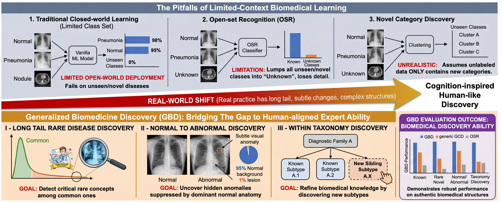
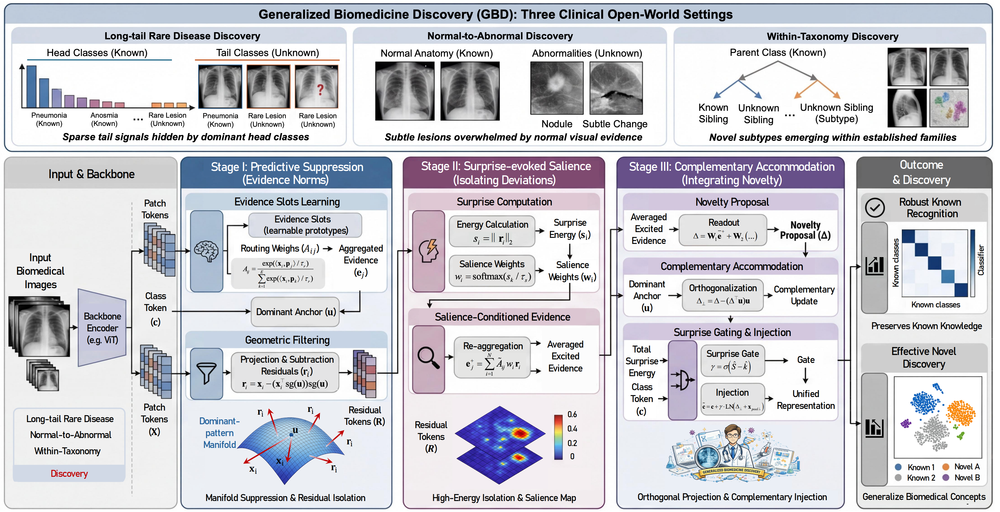

# Generalized Biomedicine Discovery (GBD)

Official PyTorch implementation of **"Generalized Biomedicine Discovery"** (ECCV 2026).

**[📄 Paper](https://lytang63.github.io/generalized-biomedicine-discovery/ECCV2026___Generalized_Biomedicine_Discovery__Camera_Ready_.pdf)** | **[🌐 Project Page](https://lytang63.github.io/generalized-biomedicine-discovery)** | **[🖼️ Poster](https://lytang63.github.io/generalized-biomedicine-discovery/assets/Generalized_Biomedicine_Discovery_ECCV2026_Poster_v3_3840x2880.png)**

---

## Overview

Medical discovery faces three open-world challenges simultaneously: **long-tail rare diseases**, **subtle lesions surrounded by normal anatomy**, and **unseen subtypes within diagnostic families**. GBD provides the first unified benchmark for these real biomedical shifts, along with **SCAN** (Surprise-evoked Complementary AccommodatioN), a cognition-inspired method that reveals novelty suppressed by dominant visual patterns.

<div align="center">
  
</div>

**Figure 1: GBD in practice.** Real biomedical data shift beyond the closed world. GBD formalizes three realistic discovery regimes that mirror clinical practice.

---

## Key Contributions

- **🏥 Three Clinical Settings**: Long-tail rare disease discovery, normal-to-abnormal discovery, and within-taxonomy discovery.
- **💡 Dominant-Pattern Insight**: Recurring structure forms a visual manifold that masks subtle novelty — the shared problem across all three settings.
- **🧠 Cognition-Inspired SCAN**: Predictive suppression, surprise-evoked salience, and complementary accommodation.
- **🔌 Plug-and-Play Design**: Works with SimGCD, LegoGCD, SelEx, or other GCD frameworks without changing their losses.

---

## Installation

### Requirements
- Python 3.8+
- PyTorch 1.10+
- CUDA 11.0+ (for GPU training)

### Setup

```bash
# Clone the repository
git clone https://github.com/lytang63/generalized-biomedicine-discovery.git
cd generalized-biomedicine-discovery

# Create conda environment
conda env create -f environment.yml
conda activate gbd

# Or install with pip
pip install -r requirements.txt
```

---

## Data Preparation

Download the following datasets and organize them under `data/datasets/`:

- **GastroVision**: Gastroscopic images
- **HistoSet**: Histopathology images  
- **MLL23**: Microscopy leukemia images
- **DERM12345**: Dermatology images

Expected directory structure:
```
data/
└── datasets/
    ├── gastrovision/
    ├── histoset/
    ├── mll23/
    └── derm12345/
```

---

## Quick Start

### Training

Train on GastroVision with Setting I (long-tail rare disease discovery):

```bash
bash contrastive_train_gastrovision.sh
```

For other datasets and settings:
```bash
bash contrastive_train_histoset.sh     # HistoSet
bash contrastive_train_mll23.sh         # MLL23
bash contrastive_train_derm12345.sh     # DERM12345
```

### Feature Extraction

```bash
bash bash_scripts/extract_features.sh
```

### Clustering

```bash
bash bash_scripts/k_means.sh
```

---

## Method: SCAN

<div align="center">
  
</div>

**Figure 2: SCAN method overview.** SCAN refines representations through three steps: **(I)** Learn the dominant-evidence concept and suppress predictable visual patterns to reveal residual signals; **(II)** Score residuals by "surprise", highlighting sparse high-energy deviations and aggregating them into salient evidence; **(III)** Transform salient evidence into complementary updates and inject via gated fusion, constraining interference with known concepts while enhancing novel structure.

### Integration

SCAN is a lightweight plug-and-play layer inserted after the backbone and before any unchanged GCD head:

```python
from models.gbd_layers import SCAN

scan = SCAN(embed_dim=768, num_evidence_slots=16, use_gru_update=True)
class_token, patch_tokens = backbone(image)
updated_class_token = scan(patch_tokens, class_token)
# Feed into your existing GCD projection/head
```

---

## Results

SCAN demonstrates consistent improvements across all three discovery settings:

| Setting | Metric | Baseline | + SCAN | Δ |
|---------|--------|----------|--------|---|
| Setting I (Long-tail) | All Acc | 65.2 | **75.7** | +10.5 |
| Setting II (Normal→Abnormal) | All Acc | 58.3 | **72.5** | +14.2 |
| Setting III (Taxonomy) | All Acc | 71.4 | **83.7** | +12.3 |

See the [project page](https://lytang63.github.io/generalized-biomedicine-discovery) for detailed results and analysis.

---

## Citation

If you use GBD or SCAN in your research, please cite:

```bibtex
@inproceedings{tang2026gbd,
  title={Generalized Biomedicine Discovery},
  author={Tang, Luyao and Yang, Yingkai and Chen, Hanqi and Zheng, Jiewei and Chen, Chaoqi and Chen, Cheng},
  booktitle={European Conference on Computer Vision (ECCV)},
  year={2026}
}
```

---

## License

This project is released under the [MIT License](LICENSE).

---

## Contact

For questions or collaborations, please contact:
- Luyao Tang: lytang63@connect.hku.hk
- Cheng Chen: chencheng@hku.hk

---

**Acknowledgments**: This work was supported by the University of Hong Kong, Shenzhen University, and Xiamen University.
